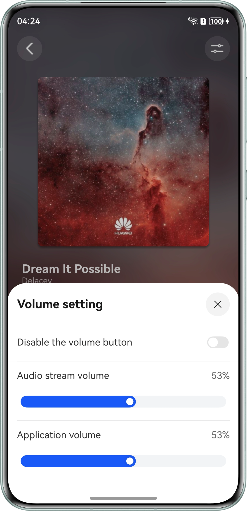

# Audio Stream Volume Management

## Overview
This sample shows how to obtain and set the volume, adjust the volume using gestures, customize the volume panel, and shield the volume button.

## Preview


## How to Use

1.  Download the sample code and open the app.
2.  Access the playback page and tap the play button to play music. Tap the icon in the upper right corner to access the volume settings. You can disable the system volume button by toggling the switch, and can also adjust the audio stream volume and app volume by sliding the volume bars.

## Project Directory

```
├──entry/src/main/ets/
│  ├──common                           // Module components. 
│  │  └──CommonConstants.ets           // Common constants. 
│  ├──components                       // Module components. 
│  │  ├──AVVolumePanelView.ets         // System volume bar component. 
│  │  ├──ControlAreaComponent.ets      // Playback control area component. 
│  │  ├──SystemVolumePanelView.ets     // Custom system volume bar component. 
│  │  └──VolumePanelView.ets           // Custom volume bar component. 
│  ├──entryability
│  │  └──EntryAbility.ets              // Entry ability lifecycle callbacks. 
│  ├──entrybackupability
│  │  └──EntryBackupAbility.ets        // EntryBackupAbility lifecycle callbacks.
│  ├──model                        
│  │  └──SongData.ets                  // Song entity. 
│  ├──pages
│  │  ├──Index.ets                     // Home page.                             
│  │  └──Player.ets                    // Playback page. 
│  ├──player                             
│  │  ├──AudioRendererController.ets   // AudioRenderer playback control. 
│  │  └──AudioVolumeController.ets     // AudioVolumeManager volume management.
│  ├──utils
│  │  ├──ColorTools.ets                // Background color class. 
│  │  ├──Logger.ets                    // Log utility. 
│  │  └──MediaTools.ets                // Media utility. 
│  └──viewModel
│     └──PlayerViewModel.ets           // Playback page data. 
└──entry/src/main/resources            // Static resources of the app.
```

## How to Implement

1.	Use audioVolumeManager to manage the system volume. Slide the custom volume bar to adjust the system volume and listen for system volume changes.
2.	Use audioVolumeManager to manage the app volume. Slide the app volume bar to adjust the app volume and listen for app volume changes.
3.	Use audioRenderer to manage the audio stream volume. Slide the audio stream volume bar to adjust the audio stream volume.
4.	Register inputConsumer.on('keyPressed') to intercept the volume button.

## Required Permissions
None

## Dependencies
None

## Constraints

1.	This sample is only supported on Huawei phones running standard systems.
2.	The HarmonyOS version must be HarmonyOS 6.0.0 Release or later.
3.	The DevEco Studio version must be DevEco Studio 6.0.0 Release or later.
4.	The HarmonyOS SDK version must be HarmonyOS 6.0.0 Release SDK or later.
